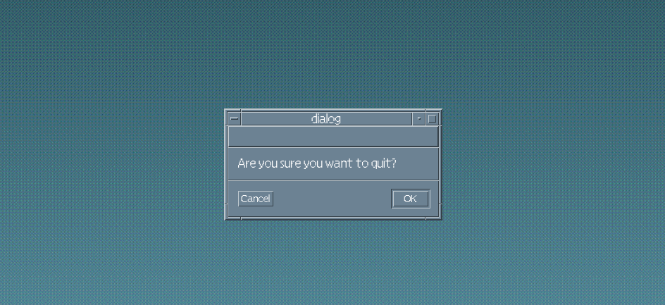

# Motif CSS

A CSS (SASS) recreation of the motif widget system.

**Warning**: This project is under development, use at your own risk.

## Build

Prerequisites:
- typescript
- sass (a recent version)

This project uses Gnu Make as its build system, since it's easy to set up and doesn't need any javascript bloat.

```sh
make
```

An example is provided by means of [index.html](./index.html).
To run a local instance, invoke the Make rule `run` (needs python3).

```sh
make run
```

## Acknowledgements

This project is inspired by other projects such as:

- [98.css](https://github.com/jdan/98.css)
- [XP.css](https://github.com/botoxparty/XP.css)
- [System.css](https://github.com/sakofchit/system.css)

Definitely check them out for more retro css goodness.

The [ref](./ref) folder contains images used as reference for Motif CSS. Most of them come from Wikipedia, DuckDuckGo Images and [this](https://www.karmak.org/archive/2003/01/X_book_caller.html#fig:CDE_desktop_) wonderful website.
If you are the owner of any of these images and do not like them being in this repo, please let me know and I will delete them ASAP.

## Contributing

I'm currently working on this project alone in my free time, but I'm open to PRs.
Check [TODO.md](./TODO.md) for an overview of what still needs to be done.
